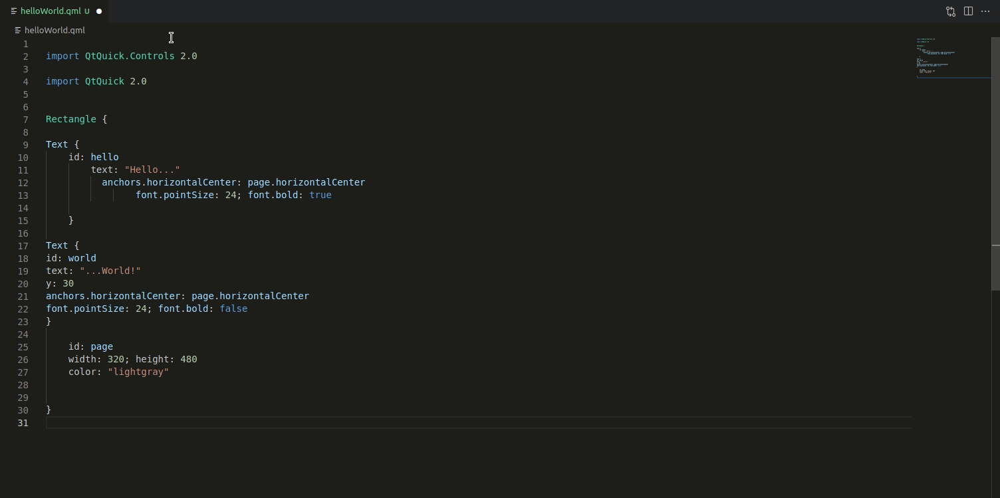

<div align="center">

# QML Format

*A Visual Studio Code extension to beautify Qt QML files.*

[](https://marketplace.visualstudio.com/items?itemName=delgan.qml-format) [](https://github.com/Delgan/qml-format/actions/workflows/tests.yml?query=branch:main) [](https://github.com/Delgan/qml-format/blob/main/LICENSE)

</div>

## Features

This extension calls [`qmlformat`](https://doc-snapshots.qt.io/qt6-dev/qtquick-tools-and-utilities.html#qmlformat) command to automatically format your QML files in accordance with the [QML Coding Conventions](https://doc-snapshots.qt.io/qt6-dev/qml-codingconventions.html).




## Requirements

You **must** have the `qmlformat` command installed on your development environment.

This utility was added to the [Qt Quick](https://doc-snapshots.qt.io/qt6-dev/qtquick-index.html) module starting with **Qt 5.15**.


## Settings

If desired, you can optionally configure some parameters:

```jsonc
{
    // You can specify the path toward the "qmlformat" executable,
    // if it's not available by default in your PATH.
    "qmlFormat.command": "/usr/bin/qmlformat",

    // You can specify additional arguments that will be passed
    // to the "qmlformat" command while formatting a file.
    "qmlFormat.extraArguments": ["--no-sort"]
}
```
